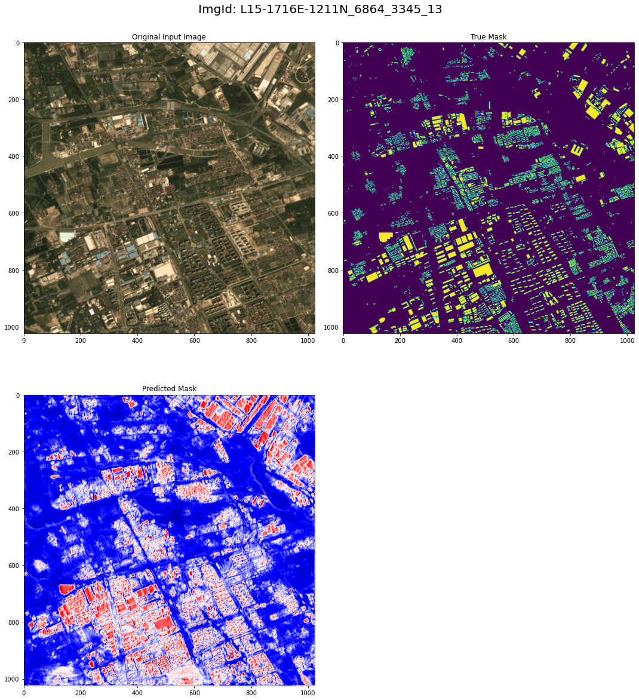

# Detecting-Building-Footprints-in-Satellite-Imagery-Spacenet7

A neural network is trained to perform image segmentation for detecting building footprints in satellite images. The dataset comprises of over 40,000 square kilometer of imagery and exhaustive polygon labels of building footprints in the imagery. The data folder consists of three subfolders,

- **images:** This folder consists of satellite images in size 1024 x 1024 and the images are in raster /geotiff <i>.tif</i> format.   
	
- **labels_pix:** This folder consists of vector files that contain building labels and its coordinates in image pixel space for each raster image in the *images* folder.      

- **labels_geo:** This folder consists of labels for buildings in <i>geojson format</i>. The coordinates are specified in terms of latitude and longitude.
